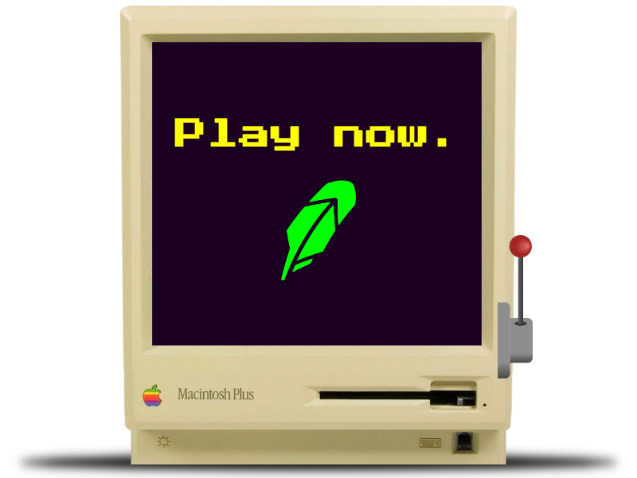
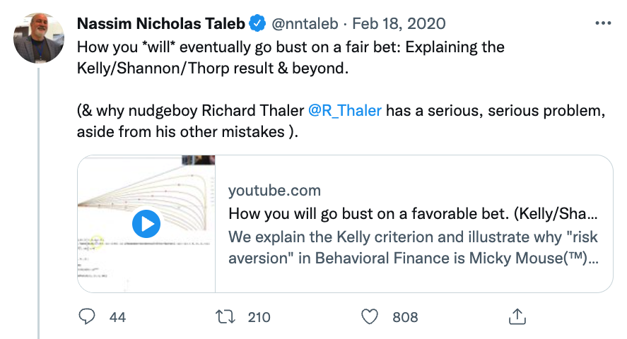

# Delete Robinhood

	<a href="https://reddit.com/r/exwallstreetbets">/r/exWallStreetBets</a>&nbsp;&nbsp;&nbsp;|&nbsp;&nbsp;&nbsp;
	<a href="mailto:deleterobinhood@gmail.com">deleterobinhood@gmail.com</a>

<i>Feeling lucky, Robinhood user?</i>

Let's say someone asks if you want to gamble.

- You have a 60% chance of doubling (+$100).
- You have a 40% chance of halving (-$50).
- You have $100 and can play 1000 times.\*

**Should you play? No. Life is not a coin flip. If you're like 28% of humans, you will go bankrupt.** The mathematical fact for why is called the [Kelly Criterion](https://en.wikipedia.org/wiki/Kelly_criterion). But it's not intuitive.

**See it for yourself.** The notebook included ([fall-of-genius-traders.ipynb](fall-of-genius-traders.ipynb)) makes the concept practical. Except it supposes you're a genius, as the example. 🎉

## Contents

- [research_papers](research_papers/README.md) - 20+ studies on ranging topics
  - gambling (health destruction) - how destructive habits and well-being are formed from trading
  - market structures - how financial markets work
  - Robinhood (toxicity & regulation) - how Robinhood users lose money by design
  - WallStreetBets (retail) - how group psychology impacts individual prices and performance
- [robinhood_loss_screenshots](robinhood_loss_screenshots/README.md) - 50+ images of losses from /r/wallstreetbets.
  - [cropped_screenshots](robinhood_loss_screenshots/cropped_screenshots/README.md) - 30+ images of losses (cropped) /r/wallstreetbets
- [robinhood_ux_animations_screenshots](robinhood_ux_animations_screenshots/README.md) - gifs, mp4, and images of Robinhood's beautiful and play user interface.
- everything else (below)

<!-- START doctoc -->
<!-- END doctoc -->

## ~100% of traders are poor.

- Only 3% of traders make money. 1.1% of them make more than minimum wage.  ([study](https://papers.ssrn.com/sol3/papers.cfm?abstract_id=3423101))
- Majority of "veteran traders" (3+ years) are those with persistent losses. ([study](https://papers.ssrn.com/sol3/papers.cfm?abstract_id=2535636))

**Why are they still bad? Why haven't they quit?**  The answers lie in math and psychology.

No one goes into trading expecting to lose money and form an addiction. But that's what happens.

---

## You will fail.

Most Degen joke they gambling, but they really don't see it this way. Markets have a way of deceiving people to thinking they have an edge. The average ~~degen~~ trader makes 100s of trades each month. 720 trades/year is the minimum to be considered a daytrader. ([trader tax status](https://greentradertax.com/trader-tax-center/trader-tax-status/how-to-qualify/))

Each one of those trades are inherently slightly bad bets. (Your bid is unconditionally lower than the most favorable midpoint price.)

These losses compound quickly. As a daytrader, there is pressure to make more trades, to justify it as a full-time occupation.

> Your grandmother does not see smoking as a single event, but as a activity...
> Risk-taking (trading) is an activity, not a single event. Once you put dynamics explained, the
> results in behavioral finance become total nonsense
>
> -Nassim Taleb ([How you will go bust on a favorable bet.](https://www.youtube.com/watch?v=91IOwS0gf3g)

---

## Motivation: "Delete Robinhood?"

**Primary motives are:**

1. To provide a master resource for the relevant people (eg Robinhood employees, policy or social responsibility activists). 2. See: Am I suggesting regulating Robinhood?
2. To get users to delete Robinhood. Or convince others to do so.
3. To simply be helpful, for whatever your project may be.

**Why Robinhood (not all brokerages)?**

Robinhood stands above the competition. Robinhood is "democratizing" massive financial losses.

- They are culpable for the $5 billion wealth transfer from the poor to rich ([Bloomberg](https://www.bloomberg.com/news/articles/2022-04-27/mom-and-pop-took-a-billion-dollar-bath-trading-pandemic-options), [study](https://papers.ssrn.com/sol3/papers.cfm?abstract_id=4065019)).
  - They are purveyors of lottery options ([average 12.6% bid-ask spread](https://papers.ssrn.com/sol3/papers.cfm?abstract_id=4065019)).
- They optimize for destroying lives- (options) trading addiction and minimal guardrails (see: [Why 100% of daytraders are poor](#why-100-of-traders-are-poor).
  - Robinhood users trade 14X more stocks & 88X more 1-10 day expiry options vs Schwab's. ([NYT](https://www.nytimes.com/2020/07/08/technology/robinhood-risky-trading.html))

They take no action to curb the virality of said wealth and life destruction.

Robinhood uses its playful user interface (see: [ux folder](robinhood_ux_animations_screenshots/README.md)) to engages users, which can be good. But so far, there's little sign they optimize for the user's well-being.

---

## Contribute

The best way everyone can help would be to star this repo and sharing this repo.

If you're more motivated (thank you), please feel free to

- add suggestions, correct mistakes
- add additional data (coding, datasets), resources, analyses, ...
- email me: if you or anyone you know work at Robinhood, consider "whistleblow"ing eg providing real data, leadership culpability.
- email me: let me know if you feature the work.
  - No permission needed, but I'd appreciate a shoutout (eg on a YouTube video).

It's not clear how frequently (if at all) I will make updates. I'm quite busy. But the more people engage, the more time and energy I will set to growing this.

---

## Notes & FAQ

A lot of the language is intentionally unhedged (100% instead of 99%) to make the lessons absolutely clear.

**Am I suggesting regulating Robinhood or trading?**

Not sure. That's for you to decide and if you want to action, all things considered. You can read academics paper arguing for regulation in "research_papers" folder.

**"There are daytraders who make money."**

Assume they're lying, lucky, new (not sufficient data), etc.. Assume it's not you.

**Are all trades really 50% odds?** No. A lot of the language is oversimplified to make the lessons absolutely clear.

If GOOGL is $100, but you sell a $110 call option, your chance of profiting is high. But your risk is proportionally high. Your potential loss is enormous if GOOGL goes to $120. - Ultimately, the risk/reward will always be slightly negative (but lead major losses long-run). It's why market makers (eg Citadel pay to be the counterpart for your trade.

**If pros can do it, why can't I?**
Most pros who work 100+ hours a week are wasting their lives. That said, the pros that do make money on betting risk less than 1% per trade (see: [Kelly Criterion](https://en.wikipedia.org/wiki/Kelly_criterion)).
