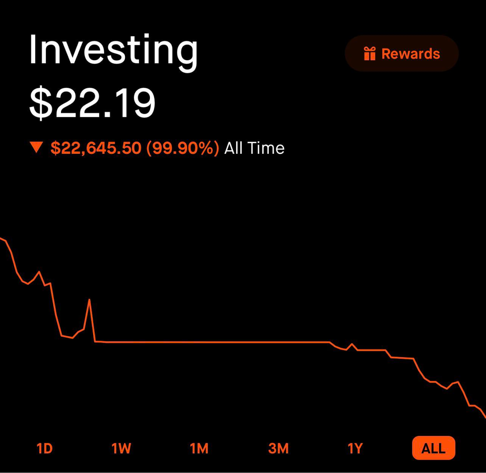
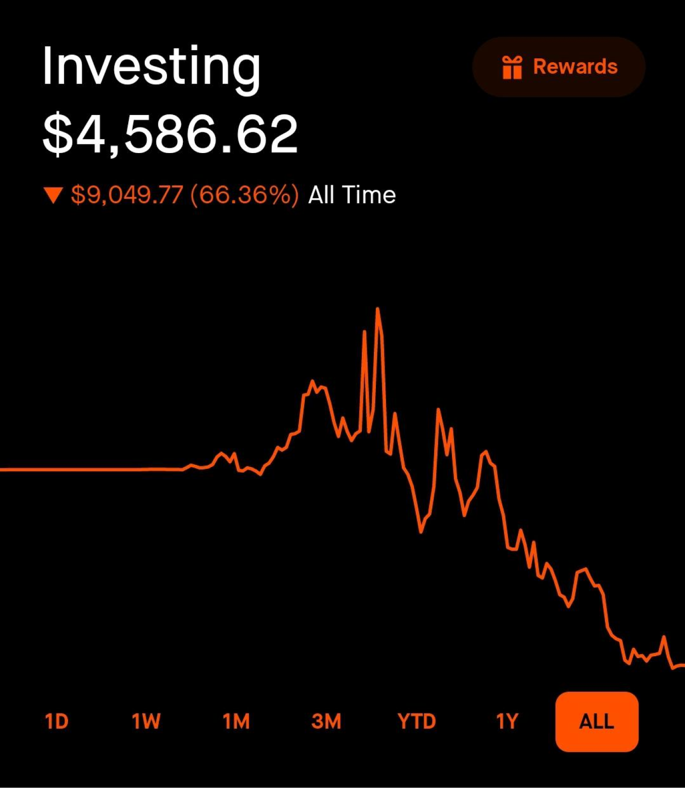
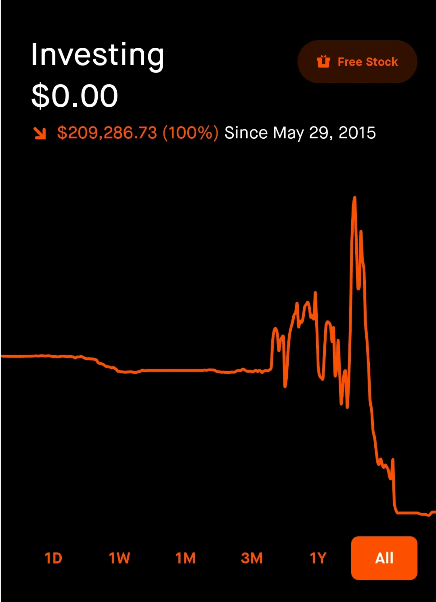
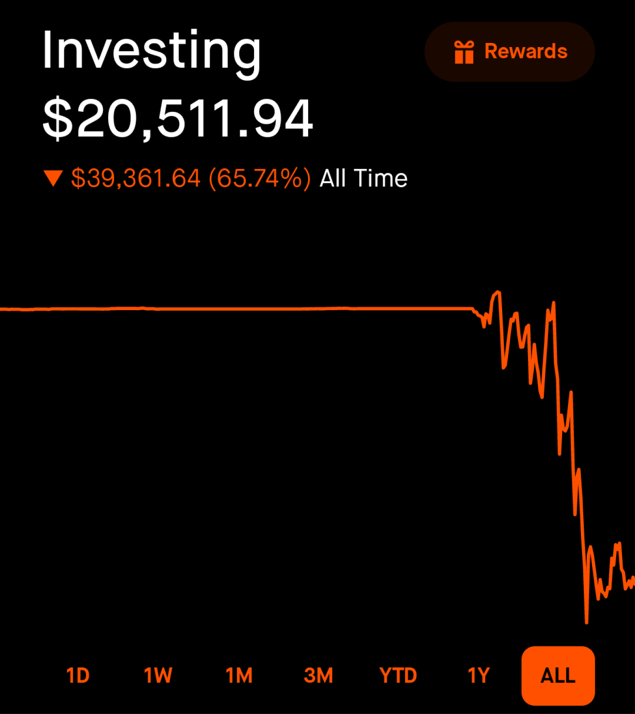

# Cropped Screenshots (Robinhood Losses)

These are loss screenshots, mostly taken from [/r/wallstreetbets](https://www.reddit.com/r/wallstreetbets/), all are Robinhood.

They are cropped to show only Robinhood's start screen (dashboard).

The start screen includes:
1. Current account balance
2. Portfolio's performance numbers, expressed in absolute dollar amount ($) and overall percentage %, for the given period.
3. Portfolio's performance chart, for the given period/

The selectable date range for performance measures include:
1. 1D - 1 day
2. 1W - 1 week
3. 1M - 1 month
4. 3M - 3 months
5. YTD - year-to-date
6. 1Y - 1 year
7. ALL - since account's inception

Below are some of the screenshots.

|  |  |
|:--|:--|
| | 