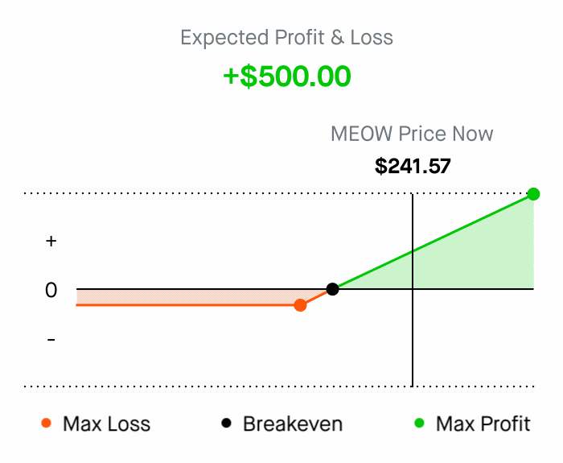
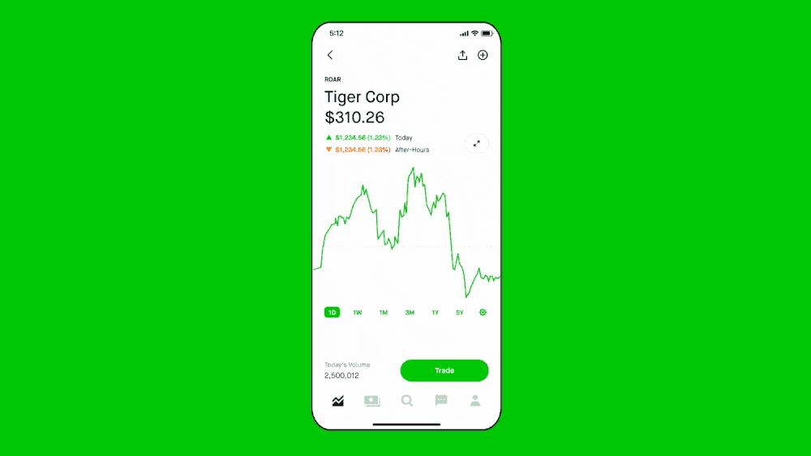
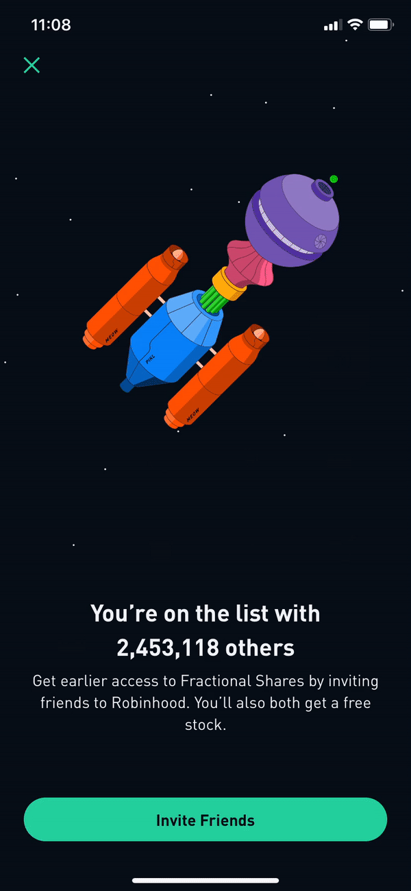
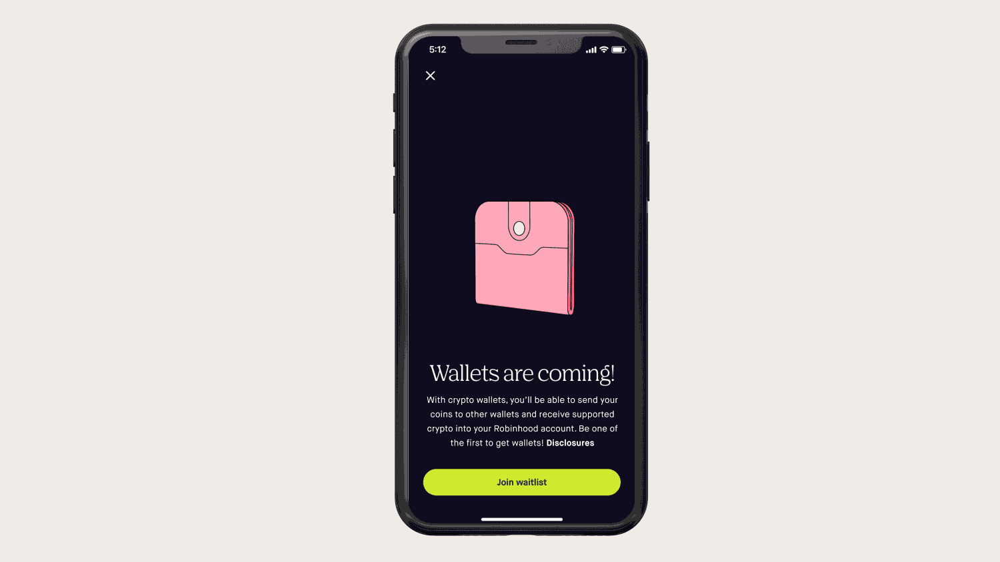

# Robinhood UX Animations & Screenshots
These are Robinhood's various animations & screenshots (images, gifs, mp4), including screens (eg messages, settings, notifications) & user flow (eg creating account, sorting, save to collection, ...). Most are fine and provided to be useful, in my opinion. Still, there are arguments to be made otherwise, eg how the playful animations optimize for frequent usage (thus encouraging active trading, not investing).

These are mostly taken from Google Images, [screenlane](https://screenlane.com/screens/product/robinhood), Vimeo ([@dirkjanhaarsma](https://vimeo.com/dirkjanhaarsma)) or directly from Robinhood's website.

Research on the UX (impact, observations, etc.) are include in the research_folders directory ([link](/../research_papers/README.md)).

|  | |
|---|:--|
|  |  |

